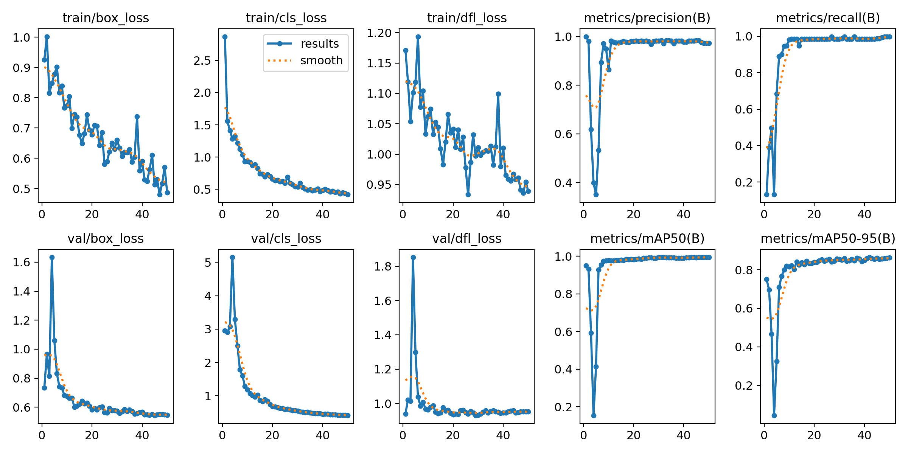
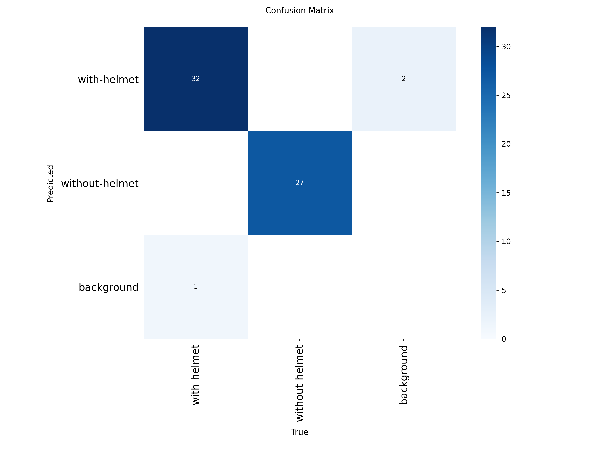

# 🪖 Helmet Protect Lock (YOLOv8 NCNN Real-Time Detection)

[](https://www.python.org/)
[](https://ultralytics.com)
[](https://github.com/Tencent/ncnn)
[](LICENSE)
[](#-model-performance)

ระบบตรวจจับการสวมหมวกกันน็อกอัจฉริยะ (Helmet Detection) แบบ Real-time ด้วย **YOLOv8n** ที่ถูกแปลงเป็นโมเดลความเร็วสูง **NCNN** ออกแบบมาเพื่อให้สามารถประมวลผลบน PC ทั่วไปและอุปกรณ์ขนาดเล็ก (Edge Devices / Embedded) ได้อย่างลื่นไหลโดยไม่ต้องพึ่งพา GPU แรงๆ มาพร้อม **Desktop GUI Control Center** สำหรับสั่งงานได้ง่ายๆ เพียงคลิกเดียวโดยไม่ต้องพิมพ์คำสั่งใน Terminal

---

## ✨ คุณสมบัติเด่น (Features)

1. **🚀 ประมวลผลเร็วด้วย NCNN Format:** 
   - รันบน CPU ทั่วไปได้ด้วยความเร็ว ~90 ms ต่อเฟรม (~11-15 FPS)
   - ไม่กินทรัพยากรเครื่อง เหมาะสำหรับอุปกรณ์สเปกประหยัด
2. **🪞 โหมดกระจก (Mirror Mode):** 
   - สลับภาพซ้าย-ขวาสำหรับกล้องหน้า/Webcam ให้เป็นธรรมชาติได้ทันที (กดปุ่ม `M` ขณะเปิดกล้อง หรือเลือกเปิด/ปิดจากหน้า GUI)
3. **🖥️ หน้าต่าง GUI ควบคุมครบวงจร (Desktop UI):** 
   - ดับเบิลคลิกเปิดโปรแกรมผ่านไฟล์ `.bat` 
   - เลือกโหมดสลับระหว่างกล้อง Webcam สด หรือเลือกภาพ/โฟลเดอร์/วิดีโอจากเครื่อง
   - เลือกระหว่างโมเดล NCNN (เร็วสุดบน CPU) หรือ PyTorch `.pt`
   - ปรับค่าความมั่นใจ (Confidence Threshold) ได้ด้วย Slider แบบเรียลไทม์
4. **📸 เครื่องมือถ่าย Dataset อัตโนมัติ (Hands-Free Auto Capture):** 
   - ระบบตั้งเวลาถ่ายภาพอัตโนมัติ (เช่น ถ่ายทุกๆ 2 วินาที จำนวน 100 ภาพ)
   - มี HUD นับถอยหลังและบอกจำนวนภาพบนหน้าจอ ช่วยประหยัดเวลาในการเก็บข้อมูลเทรนโมเดล
5. **☁️ สคริปต์เทรนโมเดลบน Cloud GPU:** 
   - มีสคริปต์ `train_on_colab.py` สำหรับส่งไปเทรนบน Tesla T4 บน Google Colab พร้อมบีบอัดและ Export เป็น NCNN อัตโนมัติ

---

## 📊 ประสิทธิภาพโมเดล (Model Performance)

โมเดลผ่านการฝึกสอน (Train) จำนวน 50 Epochs โดยได้ผลการประเมินความแม่นยำดังนี้:

| ตัวชี้วัด (Metric) | ค่าที่ได้ (Score) | คำอธิบาย |
| :--- | :--- | :--- |
| **mAP50** | **99.2% (0.992)** | ความแม่นยำระดับยอดเยี่ยมในการตรวจจับวัตถุ |
| **mAP50-95** | **86.5% (0.865)** | ความแม่นยำสูงในเกณฑ์ IoU เข้มงวด |
| **Precision** | **98.2% (0.982)** | ความแม่นยำของการระบุคลาส (False Positive ต่ำมาก) |
| **Recall** | **98.5% (0.985)** | ความครอบคลุมในการตรวจจับ (False Negative ต่ำมาก) |
| **with-helmet** | **mAP50: 98.9%** | ตรวจจับบุคคลที่สวมใส่หมวกกันน็อก |
| **without-helmet** | **mAP50: 99.5%** | ตรวจจับบุคคลที่ไม่สวมใส่หมวกกันน็อก |

### กราฟผลลัพธ์และ Confusion Matrix
<p align="center">
  
  
</p>

---

## 📁 โครงสร้างโปรเจกต์ (Project Structure)

```text
Helmet-protect-lock/
├── best_ncnn_model/          # โฟลเดอร์โมเดลฟอร์แมต NCNN สำหรับรันบน CPU/Edge
│   ├── model.ncnn.bin        # Weight binary
│   ├── model.ncnn.param      # Layer parameter
│   └── metadata.yaml         # ข้อมูล Class names และขนาดโมเดล
├── best.pt                   # โมเดล PyTorch น้ำหนักที่ดีที่สุด
├── app_gui.py                # ซอร์สโค้ดหน้าต่าง GUI Control Center
├── app_gui.pyw               # หน้าต่าง GUI แบบไร้หน้าต่าง Console ดำ
├── run_ncnn.py               # สคริปต์ตรวจจับภาพผ่าน Webcam / File
├── auto_capture.py           # สคริปต์ถ่ายภาพอัตโนมัติสำหรับทำ Dataset
├── train_on_colab.py         # สคริปต์คำสั่งสำหรับเทรนบน Google Colab
├── export_ncnn.py            # สคริปต์สำหรับแปลง PyTorch เป็น NCNN
├── เปิดโปรแกรม.bat           # ไฟล์ Batch สำหรับคลิกเปิด GUI ทันที
├── Run_App.bat               # ไฟล์ Batch ตัวสำรองสำหรับเปิดโปรแกรม
├── results.png               # กราฟสรุปผลการเทรน
├── confusion_matrix.png      # ตาราง Confusion Matrix
└── requirements.txt          # รายการ Library ที่จำเป็น
```

---

## 🚀 การติดตั้งและเริ่มใช้งาน (Quick Start)

### 1. ติดตั้ง Library ที่จำเป็น
```bash
pip install -r requirements.txt
```

### 2. วิธีเปิดใช้งานง่ายที่สุด (ไม่ต้องใช้ Terminal)
- บน Windows ให้ดับเบิลคลิกที่ไฟล์ **`เปิดโปรแกรม.bat`** (หรือ `Run_App.bat`)
- หน้าต่าง **Helmet AI Control Center** จะแสดงขึ้นมาให้ใช้งานได้ทันที

### 3. รันผ่าน Command Line (CLI)

#### 🎥 เปิดตรวจจับผ่านกล้อง Webcam ด้วยโมเดล NCNN:
```bash
python run_ncnn.py --source 0
```
- กดปุ่ม **`M`** เพื่อสลับโหมดกระจก (Mirror view)
- กดปุ่ม **`Q`** หรือ **`ESC`** เพื่อปิดโปรแกรม

#### 🖼️ รันตรวจจับไฟล์ภาพเดี่ยว หรือทั้งโฟลเดอร์:
```bash
python run_ncnn.py --source path/to/images/ --conf 0.5
```

#### 📸 ใช้งานระบบถ่ายภาพ Dataset อัตโนมัติ:
```bash
# ถ่ายภาพ 100 ภาพ เว้นระยะห่างทุกๆ 2 วินาทีต่อช็อต
python auto_capture.py --count 100 --interval 2.0 --output my_dataset/helmet --prefix with_helmet
```
- กดปุ่ม **`SPACEBAR`** เพื่อเริ่มถ่ายหรือกดพัก
- กดปุ่ม **`C`** เพื่อถ่ายแบบแมนนวล 1 ภาพ
- กดปุ่ม **`M`** เพื่อสลับโหมดกระจก

---

## 🛠️ รายละเอียดคลาสที่ตรวจจับ (Classes)
- **Class 0:** `with-helmet` (สวมหมวกกันน็อก - กรอบสีเขียว)
- **Class 1:** `without-helmet` (ไม่สวมหมวกกันน็อก - กรอบสีแดง)

---

## 📜 License
โปรเจกต์นี้เผยแพร่ภายใต้ [MIT License](LICENSE)
